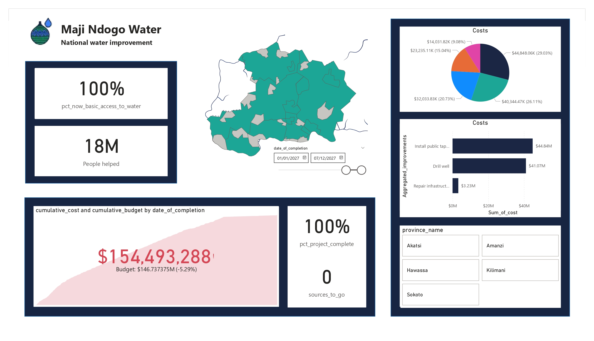
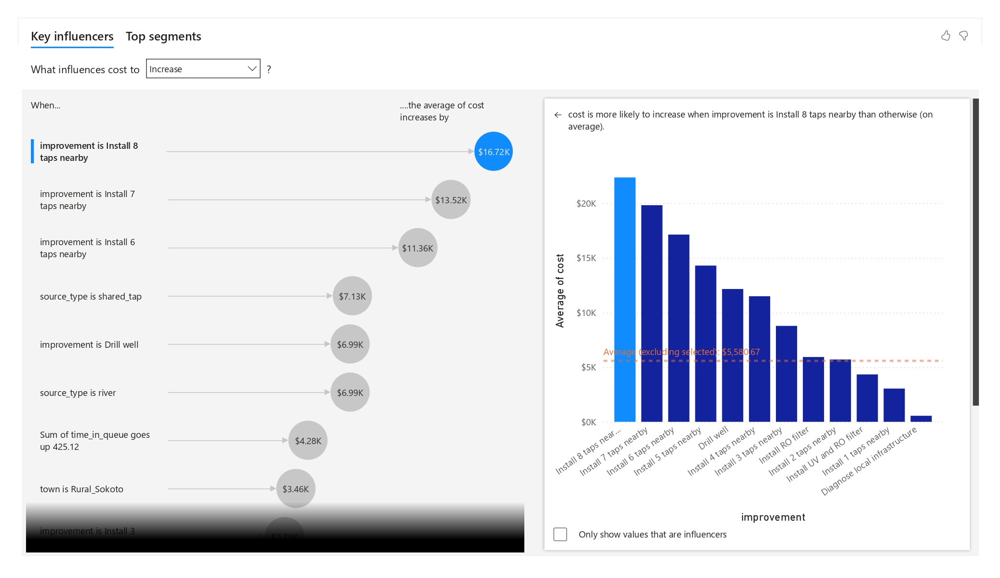
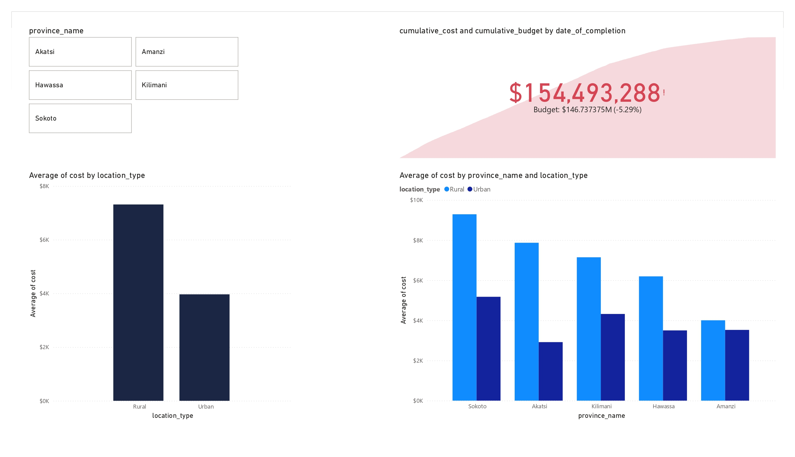
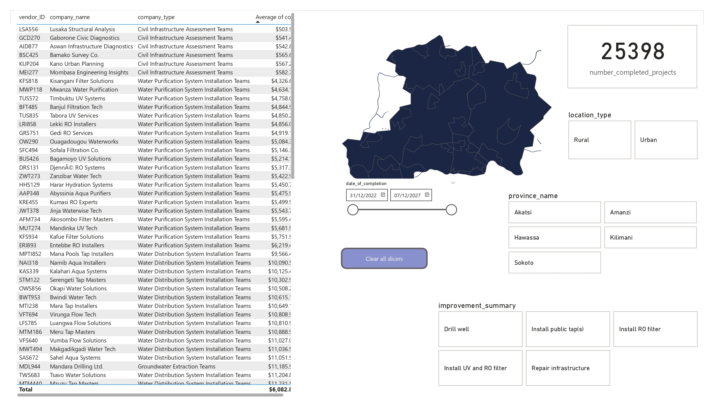

# Maji Ndogo Water Improvement Project: Achieving Universal Water Access Through Data-Driven Transparency

## Overview
The Maji Ndogo Water Improvement Project embarked on a crucial mission: to upgrade water sources and ensure basic access to clean water for the citizens of Maji Ndogo. This project, supported by international funders, is a testament to the power of **data-driven decision-making and transparency** in large-scale infrastructure initiatives. Through the development of an intuitive and comprehensive PowerBI dashboard, we have successfully monitored progress, managed budgets, and optimized operational efficiency, culminating in **100% basic access to water** for the entire population.

## The Challenge
Maji Ndogo faced a water crisis, necessitating a large-scale project to upgrade water sources. The key challenges included:
*   Ensuring **transparent tracking of funds** for an international funder and the public.
*   Monitoring project progress and **efficient resource utilization** by local vendors.
*   Forecasting budget sufficiency and identifying **areas for cost reduction**.
*   Providing **comprehensive data representation** at national, provincial, and town levels.

## Our Solution: A Dynamic PowerBI Dashboard
To address these challenges, a dynamic PowerBI dashboard was developed, serving both public transparency and internal decision-making needs. The dashboard was designed to provide clear insights into key aspects of the project, prioritizing user-focused visuals.

### Data Foundation and Evolution
The project utilized various datasets, continuously updated to reflect real-time progress. The data model underwent several refinements, including:
*   **Initial Data Setup**: Incorporating project progress, location, and infrastructure cost details.
*   **Optimization**: Streamlining the PowerBI file by removing unnecessary columns and tables (e.g., `address`, `province`, `comments` from `project_progress`; `date`, `biological`, `description`, `pollutant_ppm` from `well_pollution`; `address` from `location`; and `queue_composition`, `water_source_related_crime` tables).
*   **First Major Update (2024)**: Integration of new data (Md_water_services_data.xlsx) with updated town names, province information, and new columns like `date_started`, `date_of_completion`, `cost`, and `assigned_vendor`.
*   **Final Update (2027)**: Incorporating the final dataset to reflect project completion.
*   **DAX Measures**: Creation of sophisticated DAX measures to handle dynamic filtering for location and date, ensuring accurate calculations for total improvements, completed projects, and population metrics.

### Key Dashboard Visuals and Metrics

_Public Dashboard 2027_

#### 1. Project Progress Map
A custom shape map (MD_Full_map.json) provides a visual representation of project completion across Maji Ndogo. Users can select any town or rural area to see its immediate project status.

**Metrics:**
*   **Project progress (%)**: Number of completed projects divided by all projects, dynamically updating based on town filters.
*   **Sources to go**: The remaining number of improvements needed.

#### 2. Cost Tracking KPI Visual
This visual effectively tracks financial performance against the budget over time.

**Metrics:**
*   **Cumulative Cost**: Total actual expenditure to date.
*   **Cumulative Budget**: Total budgeted costs up to the current date.
*   **Budget Surplus/Deficit**: Clearly indicated with colors and icons, showing whether the project is over or under budget.

#### 3. Cost Breakdown by Improvement Type
A detailed breakdown reveals where money has been spent, categorized by `Aggregated_improvements`.

#### 4. Key Performance Indicators (KPIs)
Summary cards provide a quick glance at critical project metrics.

**Metrics:**
*   **Project progress (%)**.
*   **Basic access to water (%)**: Updated to include newly improved water sources.
*   **People helped**: Population now having basic access to water.
*   **More sources to go**.

## Key Insights and Impact
The dashboard provided critical insights throughout the project lifecycle:

### One-Year Update (2024)
After one year, the dashboard revealed significant progress and highlighted areas for financial concern:
*   **Water Access Improved**: Basic access to water increased from **34% to 48%**.
*   **Project Progress**: The project was **22% complete** after one year, indicating an estimated total duration of 5 years.
*   **Budget Overrun**: The project was **approximately 10% over budget**.
*   **Cost Drivers**: Initial analysis showed that drilling wells and working in rural areas were expensive, but these factors were already accounted for in the budget. The true cost driver was identified as **job duration**, specifically travel time to new locations.

### Deep Dive into Vendor Performance
The dashboard facilitated a deep dive into vendor performance to identify potential cost reduction areas:
*   **Misleading Initial Impressions**: Simply sorting vendors by average cost was misleading, as costs varied significantly based on improvement type, location (rural/urban), and province (e.g., Sokoto and Kilimani being more expensive due to challenging conditions).
    *   **MBS605**: The most expensive vendor was drilling wells exclusively in rural Sokoto, a harsh environment.
*   **Uncovering Efficiency**: A comparative analysis between **Entebbe RO Installers (ERI893)** and **Ouagadougou Waterworks (OW290)** revealed a crucial insight:
    *   ERI893, initially appearing expensive, was the **most efficient team** when compared to others in similar challenging environments (rural Sokoto).
    *   ERI893 achieved this by **staying in one place** and picking up nearby projects, significantly reducing travel costs and completing more projects. In contrast, OW290 moved frequently between towns and rural areas, incurring higher travel expenses.

_Key Influencers_

_Cost by Location_

_Vendor Analysis_

### Actionable Recommendations
Based on these insights, the project implemented a strategy to improve vendor efficiency:
*   **Educational Materials**: Creation of videos and digital infographics to explain optimal job selection and minimize travel costs.
*   **System Improvements**: Guiding teams to search for jobs closer to their current location on the system.
This initiative aimed to bring the budget under control by fostering more optimal work practices across all vendor teams.

## Project Completion (2027)
After almost four years, the Maji Ndogo Water Improvement Project has reached its successful conclusion. The final data update confirms the project's resounding success:
*   **Project Completion**: **100% of projects are complete**.
*   **Universal Access**: **100% basic access to water** has been achieved across Maji Ndogo.
*   **Impact**: **18 million people** have been helped, gaining access to improved water sources.
*   **Budget Performance**: The project concluded with a **-5.29% deviation from the budget**, with cumulative costs at $154,493,288 against a budget of $146,737,375.

This comprehensive dashboard not only provided real-time visibility into the project's financials and progress but also enabled data-driven course corrections that ensured the project's ultimate success and efficient use of resources.

## The Power of the Dashboard
The Maji Ndogo Water Improvement Project dashboard stands as a powerful example of how **transparency and insightful data analysis can transform project management and achieve ambitious humanitarian goals**. It demonstrates:
*   **Accountability**: Making project progress and expenditure visible to the public and funders.
*   **Informed Decision-Making**: Providing decision-makers with the tools to monitor progress, identify bottlenecks, and make strategic adjustments.
*   **Efficiency**: Uncovering hidden efficiencies and enabling operational improvements (e.g., optimized vendor travel).
*   **Long-term Value**: A robust, flexible data model that updates automatically, providing continuous insights without manual recalculations.

This project highlights that with curiosity and determination, the truth hidden within complex real-world data can be uncovered to drive positive change.
